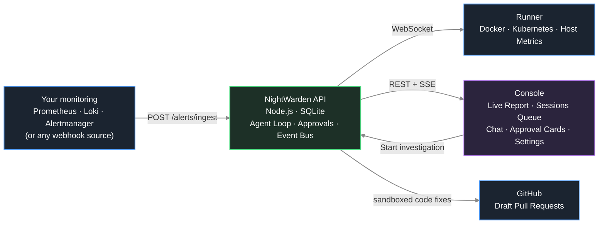

# NightWarden

[](https://github.com/PrabhatMattoo/NightWarden/actions/workflows/ci.yml)


NightWarden is a self-hosted, open-source AI SRE agent for Docker and Kubernetes workloads. It watches your servers and clusters, and when something breaks it investigates the problem on its own, works out the smallest safe fix, and waits for you to approve it before touching anything.

## Why NightWarden

An alert fires at 3am. Normally that means waking up, SSHing into a box, reading logs, checking `docker ps` or `kubectl get pods`, correlating a recent deploy, and only then deciding what to do. The investigation is slow, manual, and always lands on a tired human.

NightWarden does that first pass for you. The moment an alert arrives it starts pulling logs, container or pod state, and host metrics, works out what caused the failure, and drafts a concrete fix - restarting a service, or, when the cause is in your code and a repository is connected, a draft pull request. It writes down what it finds as it goes, so by the time you look at your screen the investigation is already written up: what it thinks broke, what it ruled out, the evidence behind each, and a fix waiting for one click.

The important part is what it will not do. NightWarden never changes anything on a server without your explicit approval. It reads freely and acts only on permission, so you get the speed of an automated responder with the safety of a human gate.

## How it works



When an alert fires, your Alertmanager (or any webhook source) posts it to the API's ingest endpoint. The API opens a session and runs the agent loop: it calls read-only tools on the relevant runner - service logs, process lists, metrics - feeds the results back to the model, and keeps going until the model proposes a fix or asks you a question.

As it works it builds an **investigation record**, one small step at a time. It writes down a hunch before testing it, then settles that hunch with a verdict and the ids of the tool calls that back it, and finally records what it recommends you do. Nothing it wrote earlier can be edited or deleted, so a claim it later abandons stays visible. How well each claim is backed is worked out by the system from those citations, never claimed by the model.

The run cannot end with a hunch left untested: the agent is pushed back until every one is settled, and if it genuinely cannot work out the cause it says so instead of inventing one.

Any action that writes to a server pauses the loop and shows you an approval card. Nothing resumes until you approve, reject, or answer. When a GitHub repository is connected and the cause is in your code, the same loop checks the code out into an isolated sandbox on the API host, builds and tests a fix there, and leaves a draft pull request for you to review.

### The three pieces

**API** is the brain, and the only place an LLM ever runs. It owns all durable state (a single SQLite file as the system of record, plus sandbox workspaces and generated proxy config in the same state directory), drives the agentic loop, gates every server write behind human approval, and talks to runners exclusively over an outbound-initiated WSS connection. When a GitHub repository is connected it is also the piece that provisions the per-session code sandbox - a hardened Docker container on its own host - and opens draft pull requests.

**Runner** is an executor you install on each host or cluster you want monitored, and it comes in two: a Docker runner and a Kubernetes runner. Which one you installed is what it is - it never probes for a platform, and one runner never serves both. It opens an outbound WSS connection to the API (so it works behind any firewall or NAT, with no inbound ports), advertises the services or workloads it can see, and executes the read and approval-gated write commands the API sends. It writes nothing to disk and remembers nothing across restarts. It is optional: a fully read-only investigation can run on your metrics, logs, and connected repository alone, and a runner adds container/host evidence and approved remediation when installed.

**Console** is the operator UI, built around the report rather than the chat. One sidebar holds everything: your destinations at the top, your sessions in the middle, and Settings and Log out at the bottom. It collapses to a narrow icon strip when you want the full width for reading. Open an investigation and the report takes the main area - what caused the failure, the hunches behind it, the evidence with charts, the proposed fix - with the live transcript in a rail on the right that also collapses. A plain conversation keeps the chat centred and shows no report. Integrations and the audit log are full-width pages. Approval cards, the runner fleet view and settings all live here too.

## Features

- **A report, not a wall of chat.** Every investigation produces a written record the agent builds _while it works_: each hunch it raised, how it turned out, and the evidence behind it. Charts and merged pull requests are drawn from the recorded results, so the report still renders long after your metrics retention has rolled over. Each claim quotes the exact tool call behind it and carries a grade the system worked out from those citations - backed by one source, by two independent ones, or confirmed by a check taken after a fix ran.
- **It cannot finish without concluding.** A run is not allowed to end with a hunch left untested: the agent is pushed back until every one is settled, and anything it calls the root cause has to cite a tool call. A session reads "Resolved" only once a fix actually ran or the alert itself cleared - never because the model said it found the cause.
- **No mode to choose.** Ask a question and you get a plain conversation. An alert opens an investigation. If your question turns out to be an incident, the agent opens the investigation itself, so you never have to decide up front. Once a session is an investigation it stays one.
- **Docker and Kubernetes, kept apart.** They are two runners, two images and two toolsets, not one runner with a switch. A Docker runner ships no Kubernetes client and a Kubernetes runner ships no Docker client, so the agent is offered Docker tools (`GetDockerLogs`, `RestartDockerService`, ...) on a host and Kubernetes tools (`GetK8sLogs`, `RestartK8sWorkload`, `GetK8sRolloutStatus`, ...) on a cluster, and a command sent to the wrong kind of runner has no handler to reach.
- **Invisible to its own agent.** NightWarden's control plane is filtered out of every list the agent can reach - the manifest a runner advertises, the service list tool, and the resolver behind every targeted command - so it is never suggested, never addressable, and cannot be restarted mid-investigation. Identity is by container id, which an operator cannot rename out from under it.
- **Human-in-the-loop by default.** Write actions like `RestartDockerService`, `DockerBash`, `RestartK8sWorkload`, and `K8sBash` require explicit approval. Read actions run automatically so the agent can investigate without waiting on you.
- **Code fixes as draft pull requests.** Connect a GitHub repository and the agent can read the code, build and test a fix inside a hardened per-session Docker sandbox on the API host, and propose it as a draft pull request. A human always reviews and merges on GitHub - NightWarden never merges.
- **Durable suspend and resume.** A pending approval survives an API restart. You can approve hours later and the agent picks up exactly where it left off, because nothing is held in memory while it waits.
- **Works behind NAT.** Runners dial out to the API over WSS. There are no inbound ports to open on your servers.
- **Bring your own key.** Use Anthropic directly, or OpenRouter for everything else. Inference goes straight to your provider and your key never leaves your network.
- **Multi-runner.** One API coordinates as many runners as you have hosts and clusters, and a single investigation can span more than one. A fleet-level read with no runner named answers for every runner at once, each answer attributed.
- **No external infrastructure.** All durable state is one SQLite file in the state directory.
- **Bring your own monitoring.** Point your existing Prometheus, Loki, and Alertmanager (or any Alertmanager-format webhook source) at the ingest endpoint. Nothing to rip out - NightWarden plugs into the stack you already run.

## Getting started

You need Node.js 24 or newer, pnpm 11 or newer, and an Anthropic or OpenRouter API key.

### 1. Clone and install

```bash
git clone https://github.com/PrabhatMattoo/NightWarden.git
cd NightWarden
pnpm install
```

### 2. Configure the API

```bash
cp apps/api/.env.example apps/api/.env
```

Leave the LLM variables unset and pick a provider in the console after boot, or set `LLM_PROVIDER` with the matching `*_MODEL` and `*_API_KEY` to seed that choice. Either way the database owns it from then on: the environment is read once, on an install that has no configuration yet, and never again - so changing a key later means changing it in Settings, not in this file. Everything else has defaults; the full list of variables is in [Configuration](#configuration).

### 3. Start everything

```bash
pnpm dev
```

This runs the API on port 3000 and the console on port 5173 with live reload. Open `http://localhost:5173` and set an owner password on first visit.

In the console go to **Integrations**. Four plugs matter here: the **Runner** (an executor on your hosts), **Alertmanager** (where your alerts come from), **Prometheus** (metric evidence), and **Loki** (log evidence). None is strictly required to start a chat investigation; alert-triggered investigations need an alert source plus at least one evidence source (a runner, Prometheus, or Loki).

**Add a runner.** Two paths, because a host and a cluster install differently: **Docker hosts** hands you a `docker run` line, **Kubernetes clusters** a `kubectl apply` manifest. Either wizard is three steps and needs no manual config editing:

1. **Name it** - a display name is optional and only tells connected runners apart. It affects nothing else: services are identified by what your infrastructure already publishes.
2. **Install the runner** - NightWarden mints a runner token and shows a ready-to-run install command with the token baked in. Copy it and run it on the target host or cluster. The runner dials back out over WSS and appears in your fleet within seconds.
3. **Confirm what it sees** - the runner's advertised services, with the full identity key each one resolves under. Read straight from the manifest it already sent, so checking the wiring costs nothing and starts nothing.

**Wire your alerts.** NightWarden does not ship a monitoring stack - forward alerts from the Alertmanager you already run. The **Alertmanager** card hands you one ready-made receiver snippet (URL and bearer credential baked in) to paste into your `alertmanager.yml`, and that is the whole setup: an alert resolves to a service from the Compose labels and Kubernetes workload names your infrastructure already publishes, so there is nothing to label and nothing to keep in sync. The card's status reflects delivery rather than configuration - "Waiting for first alert" until a webhook actually lands, then "Receiving". The credential belongs to this alert source - one for the whole fleet (never per runner), and rotating it affects Alertmanager deliveries only. The ingest endpoint accepts the token via either an `Authorization: Bearer` header or an `X-NightWarden-Token` header and speaks the Alertmanager webhook format, recognizing it by the shape of the body (`{ alerts: [...] }`) rather than by any client-controlled header. You can also start an investigation at any time from the console chat, with no alert source at all.

**Connect Prometheus.** The **Prometheus** card takes the base URL of the Prometheus you already run (and, only if yours sits behind auth, a verbatim `Authorization` header value, stored encrypted). NightWarden only ever reads: the agent gains two query tools - an instant lookup and a range query windowed around the alert - so it can tell whether a metric climbed for hours or spiked at deploy time, with zero runners installed. The connection is probed with a real query before it saves, so a successful connect is itself the proof it is reachable. Keep Prometheus off the public internet; NightWarden needs to reach it over your private network.

**Reachable from where.** Both evidence URLs are dialled by the API, from its own machine, so an address that works in your browser is not the test. The two cases that catch people out: containerized, `localhost` means the API's own container, not the host it runs on - use `host.docker.internal:9090` for a service beside it on the same host (the shipped compose file maps that name on Linux, where Docker does not provide it). On a separate host, use an address routable on your private network. A failed probe reports what actually went wrong - a name that would not resolve, a port with nothing listening, a timeout, an expired certificate - rather than a generic failure, so the fix is usually in the message.

**Connect Loki.** The **Loki** card takes the base URL of the Loki you already run (and, only if yours needs them, a verbatim `Authorization` header value and a tenant `X-Scope-OrgID` for multi-tenant Loki - both optional, the header stored encrypted). NightWarden only ever reads: the agent gains three log tools - one for log lines (newest first, filtered in LogQL), one for log-derived metrics (rate/count over logs), and a label-discovery tool it uses to learn which labels select a service's logs, since log labels are not a fixed convention. All three window on the alert. The connection is probed against the labels endpoint before it saves, so a successful connect is itself the proof it is reachable. Loki alone is a sufficient evidence source, so a logs-first fleet with no metrics can still be investigated. Keep Loki off the public internet; NightWarden needs to reach it over your private network.

## Self-hosting

The API and the console ship as one image on a single origin, and SQLite is the system of record - one container on one Linux host with Docker, no database alongside it.

```bash
curl -O https://raw.githubusercontent.com/PrabhatMattoo/NightWarden/main/docker-compose.yml
export PUBLIC_URL=http://203.0.113.10:3000   # routable from your servers, not localhost
docker compose up -d
```

Open `PUBLIC_URL`, create the owner account, then go to **Settings → Provider**: choose Anthropic or OpenRouter, paste a key, press **Test connection**, and pick a model. Until that is done NightWarden refuses to start investigations rather than failing at the first alert. Runners and monitoring are wired up afterwards from **Integrations**, exactly as in [Getting started](#getting-started).

`PUBLIC_URL` is the only required variable - it is the address runners dial back to and Alertmanager posts to, so a browser's `localhost` is not it. Everything else is optional and listed under [Configuration](#configuration); the LLM variables seed the database on first boot only, after which the console is the place to change them.

**The state directory must be a host path mounted at the same path inside and out** - never a named volume. Code sandboxes run as sibling containers started through the mounted Docker socket, and the host's daemon resolves their workspace mounts against the host filesystem: a path that exists only inside the container does not error, it mounts an empty directory and every sandbox comes up with an empty checkout. The compose file derives both sides from one variable so they cannot drift; if you move the path, keep the mapping symmetrical. NightWarden also refuses to boot when its state directory is on the container's writable layer, since the database and secret key would be discarded on the next restart.

**Both containers run as root, deliberately.** The API drives the mounted Docker socket to start sandbox containers, and that socket is owned `root:docker` with a group id that differs on every host, so a fixed non-root user would fail on most machines. The runner reads host-owned files under its read-only `/rootfs` mount and processes under `--pid=host`, neither of which an unprivileged uid can see. Dropping privileges would also buy nothing: anything holding the Docker socket can start a privileged container, so it is already equivalent to host root. Treat socket access as the trust boundary and give it only to hosts you would hand root on.

**HTTPS.** Put Caddy (or any reverse proxy) in front, point a domain at the host, set `PUBLIC_URL=https://your-domain`, and drop the `ports` mapping so only the proxy is exposed. Without a domain, run plain HTTP and restrict the port with your firewall.

**Backup.** Everything durable is in the state directory. Stop the stack, `tar czf backup.tar.gz -C /opt nightwarden`, start it again. `secret.key` is in there: restoring the database without it leaves the stored API keys unreadable and signs every operator out.

**Upgrade.** `docker compose pull && docker compose up -d`. Pre-1.0 there are no schema migrations - a release that changes the schema is applied by deleting `nightwarden.db` and setting up again, and the release notes say when that applies.

**Architecture.** The published images are `linux/amd64`, which is what a standard cloud VM runs. `better-sqlite3` and `argon2` compile to native binaries that do not cross architectures, so on arm64 hosts - Apple Silicon, Graviton, Ampere - build locally rather than pulling.

**Building the images yourself.** `docker compose build` for the control plane, `docker build -f apps/docker-runner/Dockerfile -t nightwarden-docker-runner .` and `docker build -f apps/kubernetes-runner/Dockerfile -t nightwarden-kubernetes-runner .` for the two runners. Both build natively for whatever machine you are on; add `--platform linux/amd64` on an Apple Silicon Mac when the image is destined for an x86 host.

## Configuration

### API (`apps/api/.env`)

| Variable                              | Required | Description                                                                                                                                                                                                                                                                                                                                                                                                                                                                                                                              |
| ------------------------------------- | -------- | ---------------------------------------------------------------------------------------------------------------------------------------------------------------------------------------------------------------------------------------------------------------------------------------------------------------------------------------------------------------------------------------------------------------------------------------------------------------------------------------------------------------------------------------- |
| `LLM_PROVIDER`                        | no       | `anthropic` or `openrouter`. There is no default: leave it unset and pick a provider in console Settings instead.                                                                                                                                                                                                                                                                                                                                                                                                                        |
| `ANTHROPIC_API_KEY`                   | no       | Anthropic API key. Seeds the database on first boot only, alongside `LLM_PROVIDER=anthropic` and `ANTHROPIC_MODEL`.                                                                                                                                                                                                                                                                                                                                                                                                                      |
| `OPENROUTER_API_KEY`                  | no       | OpenRouter API key. Seeds the database on first boot only, alongside `LLM_PROVIDER=openrouter` and `OPENROUTER_MODEL`.                                                                                                                                                                                                                                                                                                                                                                                                                   |
| `OPENROUTER_BASE_URL`                 | no       | Base URL for OpenRouter. Unset means `openrouter.ai/api/v1`.                                                                                                                                                                                                                                                                                                                                                                                                                                                                             |
| `ANTHROPIC_BASE_URL`                  | no       | Base URL for an Anthropic-compatible gateway or proxy. Unset means `api.anthropic.com`.                                                                                                                                                                                                                                                                                                                                                                                                                                                  |
| `ANTHROPIC_MODEL`                     | no       | Model id for the Anthropic provider. No default: an unpicked model blocks investigations rather than guessing one.                                                                                                                                                                                                                                                                                                                                                                                                                       |
| `OPENROUTER_MODEL`                    | no       | Model id for the OpenRouter provider. No default, as above.                                                                                                                                                                                                                                                                                                                                                                                                                                                                              |
| `PUBLIC_URL`                          | no       | The address other machines use to reach this install, e.g. `https://nightwarden.example.com`. Runners dial back here and Alertmanager posts here, so it must be routable from them. Unset means the request's own origin, which is fine for local development and wrong behind a proxy.                                                                                                                                                                                                                                                  |
| `PORT`                                | no       | HTTP port the API listens on (default: `3000`).                                                                                                                                                                                                                                                                                                                                                                                                                                                                                          |
| `HOST`                                | no       | Bind address (default: `127.0.0.1`).                                                                                                                                                                                                                                                                                                                                                                                                                                                                                                     |
| `NIGHTWARDEN_DIR`                     | no       | Absolute path to the directory holding all durable state: `nightwarden.db`, `secret.key`, the per-session GitHub sandbox `workspaces/`, and the generated egress-proxy config `proxy/`. Defaults to `~/.nightwarden`; created on boot if missing. Must be absolute (a relative value fails at boot); on a Mac keep it under your home so Docker Desktop's file sharing covers the sandbox mounts.                                                                                                                                        |
| `SECRET_KEY`                          | no       | AES-256-GCM key that signs owner sessions and encrypts every credential stored at rest: provider API keys, integration tokens, and the fleet ingest token. If unset, the API generates one on first boot and writes it to a `0600` `secret.key` file in `NIGHTWARDEN_DIR`, then reuses it on every restart. Deleting that file is the same as rotating the key: it invalidates every owner session and makes those credentials unrecoverable, so each reads back as unset. Set this explicitly if you want to manage the value yourself. |
| `LOG_LEVEL`                           | no       | Pino log level for the API process, e.g. `debug`, `info`, `warn`, `error` (default: `info`).                                                                                                                                                                                                                                                                                                                                                                                                                                             |
| `NIGHTWARDEN_DOCKER_RUNNER_IMAGE`     | no       | Image the console's Docker-host install command hands out. Defaults to `ghcr.io/prabhatmattoo/nightwarden-docker-runner:latest`; override it to pin a tag or to serve the image from a private registry.                                                                                                                                                                                                                                                                                                                                 |
| `NIGHTWARDEN_KUBERNETES_RUNNER_IMAGE` | no       | Image the console's Kubernetes manifest hands out. Defaults to `ghcr.io/prabhatmattoo/nightwarden-kubernetes-runner:latest`.                                                                                                                                                                                                                                                                                                                                                                                                             |
| `PROMETHEUS_URL`                      | no       | Seeds the Prometheus integration on first boot only, so a fresh install comes up configured without opening a browser. Probed before it saves; an address that does not answer is logged and left unconfigured.                                                                                                                                                                                                                                                                                                                          |
| `PROMETHEUS_AUTH_HEADER`              | no       | Verbatim `Authorization` header value for the above, stored encrypted.                                                                                                                                                                                                                                                                                                                                                                                                                                                                   |
| `LOKI_URL`                            | no       | Seeds the Loki integration on first boot only, on the same terms as `PROMETHEUS_URL`.                                                                                                                                                                                                                                                                                                                                                                                                                                                    |
| `LOKI_AUTH_HEADER`                    | no       | Verbatim `Authorization` header value for Loki, stored encrypted.                                                                                                                                                                                                                                                                                                                                                                                                                                                                        |
| `LOKI_ORG_ID`                         | no       | `X-Scope-OrgID` tenant header for a multi-tenant Loki.                                                                                                                                                                                                                                                                                                                                                                                                                                                                                   |

### GitHub integration

Connecting a repository (console → Integrations) lets investigations read the
code, build and test a fix in an isolated checkout, and propose it as a draft
pull request that a human reviews and merges on GitHub - NightWarden never
merges. Requirements and properties:

- **Docker and git must be installed on the API host** - each code session runs
  in a hardened container there, from a `nightwarden-sandbox` image built
  locally on top of `node:24` (rebuilt automatically whenever its definition
  changes). Prerequisites are checked when you click Connect, not at 3am. If
  the API itself runs in a container it needs the Docker socket mounted.
- **The token stays out of reach.** The connect page deep-links to a
  fine-grained token with exactly Contents and Pull requests (write) on the one
  repository and a 90-day expiry; the console shows the remaining days and
  warns as it nears, and organizations that block fine-grained tokens can use
  a classic PAT instead. The token is encrypted at rest, never returned by any
  endpoint, never enters the sandbox container, and never appears in any URL
  or log: git runs host-side against the bind-mounted checkout and
  authenticates per invocation, so nothing lands in `.git/config`.
  Disconnecting tears down live sandboxes first, then deletes NightWarden's
  stored copy - full invalidation means revoking the token on GitHub.
- **Container hardening**: read-only root filesystem (the writable surfaces are
  exactly the checkout, the sandbox home, and a bounded `/tmp`), all Linux
  capabilities dropped, no-new-privileges, real CPU/memory caps (swap pinned so
  the memory limit can't be doubled; both are Settings knobs), a fork-bomb PID
  limit and an open-files limit, and the sandbox runs as the API process's own
  non-root user - the API warns at boot when it runs as root, because its
  sandboxes then do too. gVisor (`runsc`) is used automatically wherever the
  Docker host provides it; the sandbox settings can require it. The worst code
  outcome under injection is a commit on a `nightwarden/*` branch inside a
  draft PR behind GitHub's human merge gate.
- **Egress is allowlisted** (Settings → Sandbox, default). All sandbox traffic
  is forced through a shared filtering proxy - built locally from Alpine's own
  tinyproxy package, so no third-party proxy image enters the supply chain -
  that only reaches the allowlisted hosts, out of the box the npm and yarn
  registries. The agent installs what it needs itself (dependencies, global
  CLI tools into its writable home); a blocked host fails loudly, and the
  agent is instructed to name any legitimately needed one in the PR so you can
  extend the list. Container loopback is untouched, so the repo's own local
  test servers still work. The other two modes: "None" gives the container no
  network at all (dependency installs are skipped), "Open" keeps the default
  Docker bridge attached - accepting that a prompt-injected agent could then
  exfiltrate repository content.
- **Provisioning is deterministic and visible.** A session's sandbox clones the
  repo onto that session's own `nightwarden/*` branch (a resumed session finds
  its branch on the remote and continues it) and, when the repo pins
  `packageManager` or has a Node lockfile, installs dependencies up front - a
  pinned pnpm or yarn runs through corepack at its exact pinned version. Each
  stage (cloning, starting, installing) streams live to the console
  transcript. A failed install is survivable - read, edit, and PR keep
  working - and its output tail reaches the logs and the agent, which is told
  to fix or work around it before building or testing.
- **Opening the PR is deliberately not approval-gated.** The PR is a draft
  proposal; the repository's own CI and the human merge are the review layers,
  and gating creation would stall the very 3am flow this exists for. The agent
  is instructed to verify with the repo's own build and tests first and state
  in the PR body what it ran; NightWarden appends the incident context, the
  changed files, and a session reference. One session maps to one branch and
  at most one open PR - calling the tool again pushes the newest commits and
  updates it - and every PR action is recorded write-ahead in the audit log,
  so after a crash an action with an unknown outcome refuses to blindly run
  again. (Repos whose GitHub plan lacks draft PRs get a normal PR, and the
  tool result says so.)
- **Work survives every death mode.** Files must be read before they can be
  edited, edits come back as real diffs in the transcript, and a sandbox that
  idles out (default one hour, a Settings knob, alongside the session time
  budget every repo tool call extends) checkpoint-commits and pushes its
  branch before the container and checkout are removed. At boot the API reaps
  orphaned sandbox containers and salvages orphaned workspaces the same way -
  commit, push, then remove, with a failed push keeping the folder for manual
  recovery - before accepting sessions, so even an API crash mid-edit leaves
  the work on its branch rather than gone.
- We recommend enabling branch protection on the repository's default branch
  (GitHub → Settings → Branches); NightWarden's token deliberately has no
  Administration permission and cannot do this for you.

### Runners (`apps/docker-runner/.env`, `apps/kubernetes-runner/.env`)

| Variable            | Required | Description                                                                                               |
| ------------------- | -------- | --------------------------------------------------------------------------------------------------------- |
| `NIGHTWARDEN_TOKEN` | yes      | Runner credential minted from the console                                                                 |
| `WS_URL`            | yes      | API WebSocket endpoint, e.g. `wss://your-api/clients/connect`                                             |
| `HOST_PROC`         | no       | Docker runner only. `/proc` mount path when running inside a container (default: `/proc`)                 |
| `FILE_ALLOWLIST`    | no       | Docker runner only. Colon-separated paths appended to the built-in allowlist for the `ReadHostFile` tool. |
| `LOG_LEVEL`         | no       | Pino log level for the runner process (default: `info`).                                                  |

There is no variable naming the platform. A runner is a Docker runner or a Kubernetes runner because of which image you installed, and the token you installed it with says the same thing; if the two disagree the API refuses the connection and says so. Kubernetes access comes from the runner's kubeconfig or in-cluster service account (via `@kubernetes/client-node`), so there is no Kubernetes-specific env var either. A runner's display name is set when you add it in the console, never on the runner itself. Write tools like `RestartDockerService`/`DockerBash` are always offered and always gated: a write suspends the investigation for human approval, so there is no mode to configure and no env var to set.

## Development

`pnpm dev` is all you need for day-to-day work; it runs every app from source with live reload, so there is no build step involved.

To exercise the alert pipeline locally without a monitoring stack, POST an Alertmanager-format body to the API's `/alerts/ingest` endpoint, which drives an investigation end to end on your machine.

Three checks gate every change, across every package:

```bash
pnpm typecheck
pnpm test
pnpm format:check   # pnpm format fixes what it reports
```

These are exactly what CI runs. `.github/workflows/verify.yml` holds the definition; `ci.yml` calls it on every pull request and push to `main`, and `publish-images.yml` calls the same one before it pushes anything to the registry, so a release can never clear a lower bar than a pull request.

A production build (compiled output for deployment) is available with:

```bash
pnpm build
```

`@nightwarden/shared` and `@nightwarden/runner-transport` have no build step - they are consumed as TypeScript source, so an edit is live everywhere immediately. The three Node apps bundle with esbuild and the console with Vite. The images install production dependencies in a stage of their own rather than pruning a full install afterwards, which is why nothing from `devDependencies` reaches a published image.

### Monorepo layout

NightWarden is a pnpm workspace. Apps consume shared code only through its packages, never through relative paths. The two runners never import from each other.

```
apps/
  api/                  Fastify API: the brain
    src/
      agent/            agent loop, prompts/, tools/ (per-domain schemas assembled in toolset.ts)
                        report.ts is the only place the investigation record is written
                        evidence-source.ts answers which source a cited call questioned
      alerts/           Alertmanager ingest, dedup, batching
      auth/             owner password, runner token minting, fleet ingest credential
      config/           operator settings: the config store, its routes, health and the run-readiness gate
      console/          serves the built console beside the API bundle, with an SPA fallback
      db/               SQLite schema and table modules (FKs on, no migrations)
      env/              values fixed at boot from the environment: state-directory paths, PUBLIC_URL, the master key
      integrations/     GitHub / Prometheus / Loki clients and connect/status routes
      llm/              provider factory (Anthropic / OpenRouter)
      remediation/      executed/rejected action log routes (the audit trail)
      runners/          runner registry and the one install-artifact endpoint
      sandbox/          per-session code sandbox: container lifecycle, git, install, egress proxy, boot salvage, repo tool handlers
      session/          session routes, console event bus (SSE), interrupt coordinator + approval executor,
                        transcript.ts projects stored messages into the render-ready items the console draws,
                        list.ts derives each session's row (its status word, severity)
      ws/               runner registry/routing, command transport
      dispatcher.ts     single entry point for every investigation
      logger.ts         the process logger
      secrets.ts        encrypt/decrypt/mask for every credential stored at rest
  docker-runner/        Executor for one Docker host: the hands
    src/
      commands/         command dispatch (registry.ts, which decodes the wire) + host, file tools
      docker/           dockerode client, container commands, service resolution
      manifest/         what this host advertises to the API
      safety/           host path allowlist for ReadHostFile
  kubernetes-runner/    Executor for one Kubernetes cluster
    src/
      commands/         command dispatch (registry.ts, which decodes the wire)
      kubernetes/       @kubernetes/client-node client, workload commands, workload resolution
      manifest/         what this cluster advertises to the API
  console/              React operator UI
    src/
      api/              one typed fetch boundary (apiFetch)
      auth/             login and owner-password setup
      components/
        ui/             shadcn-style primitives (Base UI under the hood)
        layout/         the one sidebar and its collapse, the sessions list, settings modal, wizard chrome
        report/         the rendered investigation record (hunches, verdicts, evidence charts, citations)
        transcript/     transcript dispatcher + per-card panels
      hooks/            shared console event-stream (SSE) provider, attention counter, per-session report
      lib/              shared client helpers (theme, utils, toast, time, icon/status variants)
      pages/            login, fleet, add-server wizard, session view, audit log, integration config pages
packages/
  runner-transport/     Everything about talking to NightWarden, shared by both runners
    src/
      client.ts         outbound WSS client (reconnect, watchdog, manifest refresh)
      redact.ts         secret redaction and output capping, applied on the way out
      wire.ts           decoding the untrusted side of the socket
  shared/               Shared TypeScript types: the contract
    src/
      index.ts          the one public entry: explicit named re-exports, never export *
      ws.ts             runner wire protocol
      console-events.ts console event envelopes
      service-identity.ts the two unrelated identity shapes and their key builders
      tools/            tool input/output payload types, by platform: docker.ts, kubernetes.ts,
                        host.ts, common.ts (the LLM schemas live in apps/api/src/agent/tools/)
      sessions.ts       session, message and queue-row shapes
      messages.ts       canonical message parts and the native envelope a provider replays verbatim
      transcript.ts     the render-ready transcript items and their explicit tool-call states
      reports.ts        investigation record shape (hypotheses, verdicts, fixes, conviction)
      approvals.ts      approval and clarification shapes
      config.ts         agent + sandbox settings shape
      integrations.ts   integration payloads (GitHub, Prometheus, Loki)
      alerts.ts         normalized alert shapes
      auth.ts           owner auth payloads
      remediation.ts    remediation status + audit shapes
      runner.ts         Platform, the two manifest shapes, and the fleet view
```

## License

NightWarden is licensed under the [GNU Affero General Public License v3.0](LICENSE). If you run a modified version as a network service, you must make your source available to its users.

For commercial or proprietary use outside the terms of the AGPL, contact the maintainers about a separate license.
