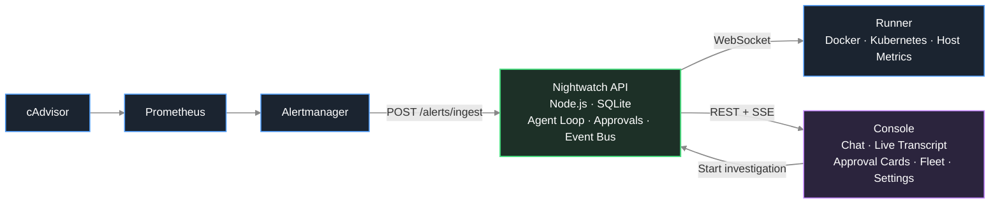

# Nightwatch


Nightwatch is a self-hosted, open-source AI SRE agent for Docker and Kubernetes workloads. It watches your servers and clusters, and when something breaks it investigates the problem on its own, works out the smallest safe fix, and waits for you to approve it before touching anything.

## Why Nightwatch

An alert fires at 3am. Normally that means waking up, SSHing into a box, reading logs, checking `docker ps` or `kubectl get pods`, correlating a recent deploy, and only then deciding what to do. The investigation is slow, manual, and always lands on a tired human.

Nightwatch does that first pass for you. The moment an alert arrives, it starts pulling logs, container or pod state, and host metrics, reasons about the root cause, and drafts a concrete remediation such as restarting a service. By the time you look at your screen, the investigation is already written up and a fix is sitting there waiting for one click.

The important part is what it will not do. Nightwatch never changes anything on a server without your explicit approval. It reads freely and acts only on permission, so you get the speed of an automated responder with the safety of a human gate.

## How it works



When an alert fires, Alertmanager posts it to the API's ingest endpoint. The API opens an investigation session and runs an agentic loop: it calls read-only tools on the relevant runner (service logs, process lists, metrics), feeds the results back to the model, and keeps going until the model proposes a fix or asks you a question. Any action that writes to a server pauses the loop and surfaces an approval card in the console. Nothing resumes until you approve, reject, or answer.

### The three pieces

**API** is the brain, and the only place an LLM ever runs. It owns all durable state in a single SQLite file, drives the agentic loop, gates every write action behind human approval, and talks to runners exclusively over an outbound-initiated WSS connection.

**Runner** is a stateless executor you install on each server or cluster you want monitored. It opens an outbound WSS connection to the API (so it works behind any firewall or NAT, with no inbound ports), advertises what it can do (Docker containers, Kubernetes workloads, or both), and executes the commands the API sends against whichever provider a service actually runs on. It also bundles its own Prometheus, Alertmanager, and cAdvisor as sidecar processes for host and container metrics, so a single install command gives you both the executor and the monitoring stack. It keeps no local state of its own - identity and configuration come entirely from its token and environment.

**Console** is the operator UI: a live, streaming session transcript, approval and clarification cards, the runner fleet view, and settings.

## Features

- **Docker and Kubernetes.** A runner detects and advertises both providers on connect. Tools that are provider-agnostic (logs, restart, exec) work against either; a handful of Kubernetes-only tools (rollout status, node status) show up automatically when a cluster is available.
- **Human-in-the-loop by default.** Write actions like `restart_service` and `exec_command` require explicit approval. Read actions run automatically so the agent can investigate without waiting on you.
- **Durable suspend and resume.** A pending approval survives an API restart. You can approve hours later and the agent picks up exactly where it left off, because nothing is held in memory while it waits.
- **Works behind NAT.** Runners dial out to the API over WSS. There are no inbound ports to open on your servers.
- **Bring your own key.** Use Anthropic, OpenAI, or any OpenAI-compatible endpoint (OpenRouter, Groq, Ollama). Inference goes straight to your provider and your key never leaves your network.
- **Multi-server.** One API coordinates as many runners as you have servers or clusters, and a single investigation can span more than one runner.
- **No external infrastructure.** State lives in one SQLite file. There is no Redis, no Postgres, and no message queue to run.
- **Self-contained runner.** Each runner ships with Prometheus, Alertmanager, and cAdvisor built in, so the target server needs nothing installed beyond the one-liner.

## Getting started

You need Node.js 20 or newer, pnpm 11 or newer, and an Anthropic or OpenAI-compatible API key.

### 1. Clone and install

```bash
git clone https://github.com/Flux690/nightwatch
cd nightwatch
pnpm install
```

### 2. Configure the API

```bash
cp apps/api/.env.example apps/api/.env
```

Open `apps/api/.env` and set `ANTHROPIC_API_KEY` or `OPENAI_API_KEY`. That is the only required value to boot; the full list of variables and their defaults is in [Configuration](#configuration).

### 3. Start everything

```bash
pnpm dev
```

This runs the API on port 3000 and the console on port 5173 with live reload. Open `http://localhost:5173` and set an owner password on first visit.

### 4. Connect a runner

In the console go to **Fleet**, then **Add a server**. The wizard walks you through three steps and needs no manual config editing:

1. **Server details** - pick the substrate (Docker or Kubernetes), name the server, and choose how it gets monitored: **"Bundle Prometheus + Alertmanager for me"**, or **"I already run my own monitoring"**.
2. **Install the runner** - Nightwatch mints a runner token and shows a ready-to-run install command with the token baked in. Copy it and run it on the target server or cluster.
   - If you chose bundled monitoring, that's it - Prometheus, Alertmanager, and cAdvisor ship inside the runner and are wired up automatically.
   - If you chose bring-your-own, the wizard also shows the webhook URL, bearer token, and Alertmanager receiver snippet to wire your own stack (generated for you, not something you write by hand), plus a **Test webhook** button to confirm it's wired correctly before moving on. This ingest credential is one fleet-wide secret, not one per server - it's minted the first time any server needs it and every bring-your-own server after that reuses the same one; the wizard's per-server snippet only changes the Prometheus `server` external label so Nightwatch can tell your servers apart.
3. **Verify the pipeline** - send a synthetic alert through the full path and confirm it reaches the runner.

The runner appears in your fleet within seconds of the install command running. If you ever need the ingest credential again outside the wizard - say, to point a pre-existing Alertmanager at Nightwatch directly - **Settings** has a section to reveal or rotate it. The ingest endpoint accepts the token via either an `Authorization: Bearer` header or an `X-Nightwatch-Token` header, speaks the Alertmanager webhook format, and identifies the source by its `Alertmanager` user-agent. You can also start an investigation at any time from the console chat, with no alert source at all.

## Configuration

### API (`apps/api/.env`)

| Variable | Required | Description |
|---|---|---|
| `LLM_PROVIDER` | no | `anthropic` or `openai`. Any value other than `openai` resolves to `anthropic` (default: `anthropic`). |
| `ANTHROPIC_API_KEY` | one of | Anthropic API key. Required when the provider is `anthropic`. |
| `OPENAI_API_KEY` | one of | OpenAI or OpenAI-compatible key. Required when the provider is `openai`. |
| `OPENAI_BASE_URL` | no | Base URL for OpenAI-compatible providers, e.g. `https://openrouter.ai/api/v1`. |
| `ANTHROPIC_MODEL` | no | Model id for the Anthropic provider (default: `claude-sonnet-4-6`). |
| `OPENAI_MODEL` | no | Model id for the OpenAI provider (default: `openai/gpt-oss-120b:free`). |
| `PORT` | no | HTTP port the API listens on (default: `3000`). |
| `HOST` | no | Bind address (default: `127.0.0.1`). |
| `NIGHTWATCH_DB_PATH` | no | Path to the SQLite file (default: `/var/nightwatch/nightwatch.db`). The parent directory is created on boot if it does not exist. |
| `SECRET_KEY` | no | AES-256-GCM key that signs owner sessions and encrypts the stored LLM key. If unset, the API generates one on first boot and writes it to a `0600` `secret.key` file beside the database, then reuses it on every restart. Deleting that file is the same as rotating the key: it invalidates every owner session and makes the stored LLM key unrecoverable, so it reads back as unset. Set this explicitly if you want to manage the value yourself. |
| `NIGHTWATCH_WORKSPACES_DIR` | no | Root directory for per-session GitHub sandbox checkouts (default: `/var/nightwatch/workspaces`). |
| `LOG_LEVEL` | no | Pino log level for the API process, e.g. `debug`, `info`, `warn`, `error` (default: `info`). |

### GitHub integration

Connecting a repository (console → Integrations) lets investigations read the
code, verify a fix and propose it as a draft pull request that a human reviews
and merges on GitHub - Nightwatch never merges. Requirements and properties:

- **Docker and git must be installed on the API host** - each code session
  runs in a hardened, throwaway `node:24` container there (checked when you
  click Connect, not at 3am). If the API itself runs in a container it needs
  the Docker socket mounted.
- The fine-grained token is encrypted at rest, never enters the sandbox
  container, and never appears in any URL or log; git authenticates
  per-invocation so nothing lands in `.git/config`.
- **Container hardening**: read-only root filesystem, all Linux capabilities
  dropped, no-new-privileges, real CPU/memory caps (swap pinned so the memory
  limit can't be doubled), a fork-bomb PID limit and an open-files limit, and
  the sandbox runs as the API process's own non-root user. gVisor (`runsc`) is
  used automatically wherever the Docker host provides it; the sandbox settings
  can require it. The worst code outcome under injection is a commit on a
  `nightwatch/*` branch inside a draft PR behind GitHub's human merge gate.
- **Network egress is deny-by-default** (Settings → Sandbox). Each sandbox sits
  on an internal Docker network with no route to the internet; its only exit is
  a filtering proxy that allows a configurable hostname allowlist (npm/yarn
  registries, `nodejs.org`, GitHub by default) and refuses everything else,
  including private and cloud-metadata addresses (`169.254.169.254`). A host a
  build legitimately needs but that isn't listed shows up under "Recently
  blocked" for a one-click add. Switch the policy to "Open" to disable
  filtering. Honest caveat: the proxy filters by hostname without terminating
  TLS, so a determined exfiltration could in principle hide behind an allowed
  CDN via domain fronting - the same limitation every hostname-allowlist
  approach shares; we do not intercept TLS.
- We recommend enabling branch protection on the repository's default branch
  (GitHub → Settings → Branches); Nightwatch's token deliberately has no
  Administration permission and cannot do this for you.

### Runner (`apps/runner/.env`)

| Variable | Required | Description |
|---|---|---|
| `NIGHTWATCH_TOKEN` | yes | Runner credential minted from the console |
| `WS_URL` | yes | API WebSocket endpoint, e.g. `wss://your-api/clients/connect` |
| `HOST_PROC` | no | `/proc` mount path when running inside a container (default: `/proc`) |
| `NIGHTWATCH_SERVER_NAME` | no | Server label attached to Docker service identities on this host, so alerts and tool calls can disambiguate the same container name across servers. |
| `NIGHTWATCH_CLUSTER_NAME` | no | Cluster label attached to Kubernetes service identities, so alerts and tool calls can disambiguate the same namespace/workload across clusters. Unset means a single, unscoped cluster identity. |
| `FILE_ALLOWLIST` | no | Colon-separated paths appended to the built-in allowlist for the `read_file` tool. |
| `LOG_LEVEL` | no | Pino log level for the runner process (default: `info`). |

Kubernetes access comes from the runner's kubeconfig or in-cluster service account (via `@kubernetes/client-node`) - there is no Kubernetes-specific env var beyond the two identity labels above. `POSTGRES_URL` and `REDIS_URL`, if present on the host, are only probed to advertise availability to the agent as investigation context; they are unrelated to Nightwatch's own storage, which is always the API's single SQLite file. Remediation mode (whether write tools like `restart_service`/`exec_command` are available) has no runner env var at all - it is stored per runner in the API's database and pushed live to the runner over its WebSocket connection whenever you toggle it from the console.

## Development

`pnpm dev` is all you need for day-to-day work; it runs every app from source with live reload, so there is no build step involved.

To exercise the alert pipeline locally without deploying a runner, start the bundled monitoring stack. It runs cAdvisor, Prometheus, and Alertmanager in Docker and points them at your local API, so a real alert can flow end to end on your machine:

```bash
pnpm dev:infra
```

Type-check and run the test suites across every package:

```bash
pnpm typecheck
pnpm test
```

A production build (compiled output for deployment) is available with:

```bash
pnpm build
```

### Monorepo layout

Nightwatch is a pnpm workspace. Apps consume shared code only through the `@nightwatch/shared` package, never through relative paths.

```
apps/
  api/                  Fastify API: the brain
    src/
      agent/            agentic loop, tool registry (docker + kubernetes), prompt context
      alerts/           Alertmanager ingest, dedup, batching
      auth/             owner password, runner token minting
      config/           settings routes and LLM config
      db/               SQLite schema and table modules (FKs on, no migrations)
      llm/              provider factory (Anthropic / OpenAI)
      remediation/      remediation-mode toggle routes
      runners/          runner registry, connect.sh handler
      session/          session routes, interrupt coordinator + approval executor
      ws/               runner registry/routing, command transport, console bus
      dispatcher.ts     single entry point for every investigation
  runner/               Stateless executor: the hands
    src/
      commands/         provider-agnostic dispatch (registry.ts) + host, file tools
      docker/           dockerode client, container commands, service resolution
      kubernetes/       @kubernetes/client-node client, workload commands, service resolution
      manifest/         capability advertisement to the API (docker, kubernetes, host metrics)
      safety/           command allowlist and secret redaction
      websocket/        outbound WSS client to the API
  console/              React operator UI
    src/
      api/              one typed fetch boundary (apiFetch)
      auth/             login and owner-password setup
      components/
        ui/             shadcn-style primitives
        layout/         shell, sidebar, settings modal, wizard chrome
        transcript/     transcript dispatcher + per-card panels
      hooks/            shared console event-stream (SSE) provider, attention counter
      lib/              shared client helpers (utils, toast, time, icon/status variants)
      pages/            login, fleet, add-server wizard, session view, audit log, unresolved alerts
packages/
  shared/               Shared TypeScript types: the contract
    src/
      ws.ts             runner wire protocol
      console-events.ts console event envelopes
      service-identity.ts docker/kubernetes service identity shapes
      tools.ts          tool input/output payload types (schemas themselves live in apps/api/src/agent/tools.ts)
      sessions.ts       session and message shapes
      approvals.ts      approval and clarification shapes
```

## License

Nightwatch is licensed under the [GNU Affero General Public License v3.0](LICENSE). If you run a modified version as a network service, you must make your source available to its users.

For commercial or proprietary use outside the terms of the AGPL, contact the maintainers about a separate license.
