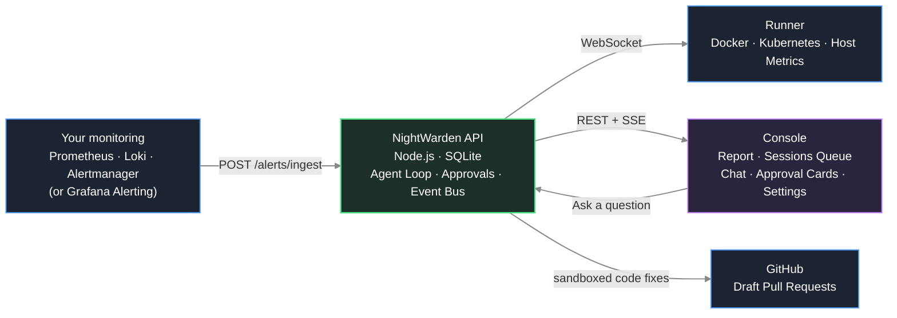

# NightWarden

[](https://github.com/PrabhatMattoo/NightWarden/actions/workflows/ci.yml)


NightWarden is a self-hosted, open-source AI SRE agent for Docker and Kubernetes workloads. It watches your servers and clusters, and when something breaks it investigates the problem on its own, works out the smallest safe fix, and waits for you to approve it before touching anything.

## Why NightWarden

An alert fires at 3am. Normally that means waking up, SSHing into a box, reading logs, checking `docker ps` or `kubectl get pods`, correlating a recent deploy, and only then deciding what to do. The investigation is slow, manual, and always lands on a tired human.

NightWarden does that first pass for you. The moment an alert arrives it starts pulling logs, container or pod state, and host metrics, works out what caused the failure, and drafts a concrete fix - restarting a service, or, when the cause is in your code and a repository is connected, a draft pull request. It records what it finds as it goes and writes the whole thing up when it is done, so by the time you look at your screen the investigation is already written up: what it thinks broke, what it ruled out, the evidence behind each, and a fix waiting for one click.

The important part is what it will not do. NightWarden never changes anything on a server without your explicit approval. It reads freely and acts only on permission, so you get the speed of an automated responder with the safety of a human gate.

## How it works



When an alert fires, your Alertmanager or Grafana Alerting posts it to the API's ingest endpoint. One webhook delivery is one alert group, and that grouping is yours: whatever `group_by` you already configured decides which alerts are investigated together, and NightWarden never regroups them on a clock of its own. The API opens a session for the group and runs the agent loop: it calls read-only tools on the relevant runner - service logs, process lists, metrics - feeds the results back to the model, and keeps going until the model proposes a fix or asks you a question.

**What the agent is handed about an alert** is everything the alert carried and nothing invented: its labels, its annotations, when it fired, and the service it resolves to when the fleet advertises one. It also gets the PromQL expression that fired, decoded out of the link Prometheus puts in the alert, so it knows the threshold without spending a call to find it, and the numbers the rule evaluated to at that instant where the sender reports them. Annotations are given as text and are never dereferenced - a `runbook_url` reaches the model as a fact, and nothing follows it, because fetching a URL out of an alert body is a request an attacker who can write an annotation would be choosing for you.

**It is also told why these alerts arrived together.** A delivery carries the labels your `group_by` resolved to, the labels every alert in the group holds, and any annotations they share. Your alert source has already worked that out, so the agent is given it rather than left to intersect the labels and guess whether what they share is the incident or a coincidence.

As it works it builds an **investigation record**, one claim at a time. Each time it settles a hunch it writes down what it tested, the verdict it earned and the ids of the tool calls that back it. Nothing it wrote earlier can be edited or deleted, so a claim it later abandoned stays on the record beside the one that replaced it. How well each claim is backed is worked out by the system from those citations, never claimed by the model.

When the run is over the agent is handed that record back with every investigation tool taken away and one left, and writes the report from it: a summary, a timeline, who was affected, and what you should do. Writing it last means it is written knowing how the investigation ended, and it can add only the prose the record has no room for, so what it says cannot outrun what the record holds.

The run cannot end on an empty record, or on a claim whose only citations are calls that answered nothing: the agent is pushed back until both hold, and if it genuinely cannot work out the cause it says so instead of inventing one.

**A fix is not believed until the alert says so.** NightWarden never asks the model whether its fix worked - it re-checks the condition that fired, and there are two independent ways it learns the answer:

1. **Your alert source tells it.** When your sender posts the resolved notification for an alert, that alert is marked cleared. This is the ordinary path and needs no configuration beyond a webhook receiver: Alertmanager's `send_resolved` is already the default, and Grafana sends one unless you turn it off.
2. **NightWarden asks the rules API itself.** For as long as an investigation has a condition nobody has seen recover, NightWarden asks whether the alerting rule that fired still holds an instance matching this alert. That is the same rule on the same evaluation interval that fired in the first place - not a query NightWarden composed, and not a threshold it guessed. Which address serves that API is something you tell it, because it is not always the one you query: VictoriaMetrics serves rules from vmalert alone, Grafana Cloud from your Grafana stack behind a different credential, and a Grafana-managed alert rule lives in Grafana rather than in any metrics backend at all. A rule that is `pending` counts as still firing. It asks often while the incident is live and progressively less as it ages, because the realistic timeline is that a fix lands, the rule's `for:` duration elapses, and the alert goes quiet some minutes after the run that fixed it has already ended.

Both write the same record, so they cross-check each other: if you have turned `send_resolved` off, the second path still notices the recovery.

If nothing can answer - the backend unreachable, the rule renamed, no rules endpoint configured - the investigation says the fix ran but recovery was never confirmed. It does not read "Resolved". An unanswerable question is never treated as a yes.

A run that had you approve a write and then goes quiet while the condition is still firing is pushed back and asked what you should do about it. It is never asked to try again: repeating a write that did not work is the exact mistake this catches.

**What a tool does and what you permit are two separate facts.** Every tool
declares an _effect_ - whether the call reads or writes - and a _policy_ -
whether it runs on its own or waits for you. Reads run freely so the agent can
investigate without waking anyone. Writes pause the loop and show you an
approval card, and nothing resumes until you approve, reject, or answer. The two
are recorded apart on purpose: there is no separate list of gated actions that
could fall out of step with the actions themselves, so the gate cannot be
forgotten when a tool is added.

Asking you a question is not a tool. It is offered to the model as one, because
tool-calling is the only channel it has to request anything, but it carries no
implementation and no policy - it always suspends, and no setting can turn that
off.

The agent is also told what an approved write did: a rejection comes back saying
you refused and that nothing changed, so it redirects rather than trying the
same call again. And when the same write has already run in this investigation,
the approval card says how many times. Restarting a service a fifth time is a
decision, not a mistake, so it is reported and never refused.

When a GitHub repository is connected and the cause is in your code, the same loop checks the code out into an isolated sandbox on the API host, builds and tests a fix there, and leaves a draft pull request for you to review.

### The three pieces

**API** is the brain, and the only place an LLM ever runs. It owns all durable state (a single SQLite file as the system of record, plus sandbox workspaces and generated proxy config in the same state directory), drives the agentic loop, gates every server write behind human approval, and talks to runners exclusively over an outbound-initiated WSS connection. When a GitHub repository is connected it is also the piece that provisions the per-session code sandbox - a hardened Docker container on its own host - and opens draft pull requests.

**Runner** is an executor you install on each host or cluster you want monitored, and it comes in two: a Docker runner and a Kubernetes runner. Which one you installed is what it is - it never probes for a platform, and one runner never serves both. It opens an outbound WSS connection to the API (so it works behind any firewall or NAT, with no inbound ports), advertises the services or workloads it can see, and executes the read and approval-gated write commands the API sends. It writes nothing to disk and remembers nothing across restarts. It is optional: a fully read-only investigation can run on your metrics, logs, and connected repository alone, and a runner adds container/host evidence and approved remediation when installed.

**Console** is the user UI, built around the report rather than the chat. The sidebar holds navigation and nothing else - Agent, Investigations, Integrations, then Settings and Log out - and collapses to a narrow icon strip when you want the full width for reading. Your conversations live behind a disclosure in the Agent page header; investigations have a page of their own, grouped by status. Open one from that list and the report takes the main area - the summary, the timeline, what held up and what was ruled out, each with its evidence and charts - with the transcript in a rail on the right that also collapses. A plain conversation keeps the chat centred and shows no report. Approval cards, the runner fleet view and settings all live here too.

**Watching a run end never moves the page under you.** While it works the chat has the whole stage, because a report being written in front of you is not worth reading. When the agent finishes, it posts its closing message and then a card: first that the report is being written, then that it is ready. Nothing changes until you click it. Arriving from the Investigations list is already a deliberate act, so that still opens the record directly.

**If the write-up does not happen, the page says so.** The likeliest cause is the model's own output limit - the report is the largest single thing it writes in a run - and there are three others: the context window, the time budget running out, and a model that simply declines. Whichever it was is on screen in plain words, and the card offers **Try again**, which re-runs only the write-up against everything the investigation already found. Asking for it in the chat does the same thing. The findings are never lost either way: they are recorded as the run goes, so a missing report costs you the prose and nothing else.

## The life of an investigation

Everything below is behaviour you can rely on. Where NightWarden cannot know
something, it says so rather than guessing - that rule is the reason for most of
the design here.

### One alert group, one investigation

Your alert source has already decided which alerts belong together. Alertmanager
groups by the labels in your `group_by`, holds the group open for `group_wait`,
and posts the whole group as a single webhook. NightWarden takes that grouping
as given: **one delivery is one group is one investigation.**

It does not regroup on a timer of its own. Two alerts that your Alertmanager put
in different groups become two investigations however close together they fire,
because a wrong split costs duplicated work you can see, while a wrong merge
writes one report about two incidents and stops either from resolving.

If you want more alerts investigated together, widen `group_by` in your
`alertmanager.yml`. That is the only knob, and it is one you already understand.

This works the same for Grafana Alerting, Mimir, Thanos and VictoriaMetrics:
all of them notify through Alertmanager or a fork of it, and all of them send
the same grouping information.

### What is dropped, and what is not

An alert is a **duplicate** when some investigation already covers that exact
alert and nothing has said the condition recovered. Alertmanager re-sends a
still-firing alert on `repeat_interval` - as often as every few minutes - and
every one of those repeats is dropped. Without that, a single incident would
open a fresh investigation of the identical alert all day.

Two things are _not_ duplicates. An alert that cleared and later fires again
carries a new start time, so it is a new incident and opens a new investigation.
And a genuinely different alert in a group already being investigated joins that
investigation rather than opening another - see below.

If your alert source leaves alerts out of a delivery, which Alertmanager does
when a group is very large, it says how many. NightWarden passes that straight
to the agent: _"the alert source left 6 further alerts out of this delivery, so
this group is larger than what you can see here."_ An investigation working from
a partial group is told it is working from a partial group.

### Waiting for a free slot

**Ten investigations run at once by default**, a setting under Settings → Agent.
An investigation waiting on your approval still counts, because starting another
one only puts a second write in front of the same person.

When every slot is busy, alerts **wait their turn**. They are never dropped -
your alert source was already told the webhook was accepted, and it has nobody
to retry to. The Investigations page shows a band saying how many are waiting,
how many are running, and how long the oldest has waited. A slot frees when a
run ends, and the alerts that have waited longest go first, as a whole group.

An alert that recovers while it is waiting is never investigated at all. There
is nothing to look into, and no investigation is created to explain that.

Two things are refused rather than queued, because you are watching the screen
when they happen: starting an investigation yourself from the console when all
ten slots are busy, and starting a chat when twenty are already running. You get
a message immediately instead of a spinner with no end in sight. The chat number
is a runaway backstop rather than a usage limit; reaching it means something is
very wrong.

### When another alert fires mid-investigation

If a new alert arrives for a group NightWarden is already investigating, it
joins that investigation - even if the run is paused waiting for your approval.
The agent is _told_ the alert fired. It is never asked whether the alert belongs,
because your alert source already answered that.

The alert appears in the transcript at the point it interrupted, so you can read
what the agent knew and when. It is also added to the investigation's alert list,
which means the investigation cannot be called Resolved until that alert clears
too.

An alert for any other group opens its own investigation, or waits for a slot.

### What a status means

| Status              | What it means                                                 | What happens next                                                      |
| ------------------- | ------------------------------------------------------------- | ---------------------------------------------------------------------- |
| **Investigating**   | A run is working right now                                    | Nothing to do                                                          |
| **Action required** | It is waiting on you, or it finished with something to act on | Approve, answer, or act on the recommendation                          |
| **Resolved**        | Every alert on it stopped firing                              | Nothing to do. This is the only status that means the incident is over |
| **Inconclusive**    | The run ended without anything for you to act on              | Read what it ruled out; it may still recover on its own                |
| **Failed**          | The run broke - usually the model provider                    | Retried automatically if the cause was temporary; see below            |

**Resolved is never inferred.** It does not mean a fix ran, and it never comes
from the model saying it found the cause. It means the alert stopped firing,
confirmed either by your alert source's resolved notification or by asking
Prometheus whether its rule still holds. When nothing can answer, the record
says recovery was not confirmed rather than claiming it.

Underneath, a session's run is in exactly one of three states: **running**,
**suspended** (parked on you), or **done**. Running and suspended both hold one
of the ten slots. This is what makes the count on the Investigations page true
rather than an estimate, and what lets a restart tell a run that was alive from
one that had finished.

### When NightWarden restarts

There is one process and one SQLite file, so a restart is the only way work is
interrupted. Nothing is held in memory that matters: alerts are written to disk
the moment they arrive, before anything decides whether there is a slot.

**Alerts still waiting** are still waiting. They start as soon as the API is
back and a slot is free.

**A run that was working** is picked up. If its last exchange was cut in half,
NightWarden repairs it where that is safe - a read can simply be run again -
and unwinds past it where it is not, because a write it cannot prove the outcome
of must never be replayed. If the alert is still firing and the run was recent,
it carries on from its last complete exchange. Otherwise it is marked as
interrupted, so it reads as broken rather than as an investigation that
concluded nothing.

**A run parked on your approval** is left alone. It is waiting, not broken, and
it keeps its slot.

There is one narrow case in between. If NightWarden stops in the instant between
running an approved command and recording its result, it comes back knowing the
command ran but not what it returned. It does not run it again - that is the one
thing it must never do. The investigation stops with a note saying exactly that:
_"whether the call took effect is unknown - check the target before approving it
again."_

### Stopping, checking in, and running out of room

**You can stop a run.** The stop is checked between a turn's tool calls and the
approval gate, so a run you stopped ends as stopped rather than parking an
approval card nobody is going to answer.

**A long run checks in rather than being killed.** After its time budget
(Settings → Agent, thirty minutes by default) it finishes the step it is on and
asks whether to continue. Say no and it writes up what it has rather than
stopping mid-thought. Every repository tool call extends the sandbox's own idle
timer, so a run doing real code work does not have its checkout swept from under
it.

**A conversation can outgrow the model's context window.** Tool results are the
bulk of it, and a long investigation eventually reaches the limit. What happens
then depends on the model.

Where the provider can summarise - Anthropic models whose catalog says they
support it - NightWarden asks for that instead of letting the request be
refused. The model is handed a summary of the earlier part of the conversation
and carries on, and the transcript marks where that happened. **Nothing leaves
the record.** Every tool result is kept in full, so the report still quotes and
charts evidence the model itself no longer holds, and every claim still cites
the exact call behind it. The threshold is derived from the model's own
published window, never a number NightWarden invented.

Where the provider cannot, the run stops and says so plainly, naming the two
things that work: start a new session, or pick a model with a larger window
under Settings → Provider. OpenRouter is deliberately left on that path: it
truncates from the middle of a conversation rather than summarising, and in an
agentic transcript the middle is where every piece of evidence lives.

### When a run fails

A failed run is retried **up to three times**, and only when the cause was worth
waiting out: a dropped connection, a rate limit, a provider having a bad day.
The retry rides the same schedule that checks whether the alert recovered, so it
is minutes apart rather than seconds - the run already spent about a minute
retrying inside itself before giving up.

It is never retried when trying again cannot work. A rejected API key, an empty
account, or a model that no longer exists fails identically every time, and
three more attempts would only write three more failures for you to read. Those
stop and wait for you, and the message says which one it was.

A retry picks up from the last complete exchange, not from the beginning.

## What the agent can see

The agent works only through typed tools. Each one returns a structured result,
and each result is kept in full so the report can quote it months later. What
follows is what those tools reach, and where they stop - because a tool that
quietly shows you less than it looked at is worse than one that finds nothing.

### The evidence it has

|                              | Needs             | What it answers                                                                    |
| ---------------------------- | ----------------- | ---------------------------------------------------------------------------------- |
| **Containers and workloads** | a runner          | State, config, image and digest, restarts, resource stats, events, processes       |
| **Service logs**             | a runner or Loki  | What the service actually printed, windowed and filtered                           |
| **Metrics**                  | a metrics backend | An instant reading, a range around the alert, what rules exist, what metrics exist |
| **Host vitals**              | a Docker runner   | CPU, memory, disk, network, kernel ring buffer, allowlisted host files             |
| **Changes**                  | GitHub            | Merged pull requests and commits in a window                                       |
| **The code**                 | GitHub            | Read, edit, build and test inside a sandbox; open a draft pull request             |

A runner is optional. A metrics backend and Loki alone are a working install - the
agent investigates on metrics and logs, and simply has no container evidence to
reach for. It is told which tools it has, so it never proposes one it lacks.

### Every result has a ceiling

A single tool result may occupy **30,000 characters**. Tools that can return a
lot drop whole items to stay under it and say in the result what they left out
and how to ask a narrower question.

A result still over the line after that is refused **whole**, and the agent is
told to narrow the call and run it again. It is never truncated, because half a
JSON result parses cleanly as a smaller truth - a list of three failing pods cut
to two reads as two failing pods, and nothing about it looks wrong.

### Reading logs

**Windows.** Loki and Docker logs take `since` and `until`, so the agent can
walk backwards through a noisy period rather than re-reading the newest lines
forever. When a result is capped it names the timestamp of its oldest line, and
that is the cursor for the next call.

Kubernetes logs take only `since`. The Kubernetes API has no end-time parameter
at all, so the tool offers the window the platform can honour and says where the
limit comes from.

**Filtering.** `contains` keeps lines holding any of the given words; `excludes`
drops them, and is applied first so an excluded line never comes back. Both
match **plain text, ignoring case, on whole lines** - deliberately not regular
expressions, because a pattern the model wrote, run over hundreds of thousands
of lines on your server, is a risk the runner would be wearing on your behalf.

**The tail is read before any filtering.** So the result carries how many lines
were actually searched and whether it reached the end of what the engine holds.
That matters: "two matches" out of two hundred lines searched and "two matches"
out of two hundred thousand are different findings, and only one of them is
evidence of anything.

### Where evidence expires

Kubernetes deletes events on a timer, commonly an hour, and does not report what
that timer is set to. So an empty event list can mean the workload is healthy or
it can mean the evidence aged out before anyone looked. The result says which
window was searched, how many events sit before it, and that a window past the
common TTL may be asking for events that no longer exist.

A deleted pod's events stay unattributable. An event carries no owner reference,
and matching on name prefixes is a guess, so events belonging to a pod that has
gone are left out rather than credited to a workload that may not own them.

### Absence is never treated as evidence

This is the rule the three sections above are instances of. A result that shows
less than the tool searched has to say so: what was looked at, what was left
out, and what the call cannot speak for. An empty list that cannot distinguish
"nothing happened" from "we did not look there" is a defect, because the agent
reads both as the first and stops.

Where the gap cannot be closed, the result states the limit rather than guessing
past it. A wrong fact is worse than a stated unknown, and a stated unknown is
itself a finding.

## Features

- **A report, not a wall of chat.** The agent records each claim as it settles it, then writes the report from that record once the run is over: a headline, a summary you can paste into a postmortem, a timeline that includes every write it was allowed to make, who was affected, and what to do next. Charts and merged pull requests are drawn from the recorded results, so the report still renders long after your metrics retention has rolled over. Each claim quotes the exact tool call behind it and carries a grade the system worked out from those citations - backed by one source, by two independent ones, or confirmed by a check taken after a fix ran. If the write-up itself fails, the reason is on screen and one click runs it again.
- **It cannot finish without concluding.** A run is not allowed to end on an empty record, or on a claim backed only by a call that returned nothing, and no claim can be recorded at all without citing one. If it cannot find the cause it records what it ruled out and says so.
- **"Resolved" means the alert stopped firing.** Not that a fix ran, and never because the model said it found the cause. NightWarden confirms recovery against the condition that fired - your alert source's own resolved notification, or by asking the rules API whether its rule still holds. When nothing can answer, the record says recovery was not confirmed rather than claiming it.
- **One investigation per alert group.** Relatedness is your alert source's call, not a guess of ours: whatever `group_by` you already configured decides what is investigated together. Ten investigations run at once by default; beyond that alerts wait their turn and nothing is dropped. See [The life of an investigation](#the-life-of-an-investigation).
- **One choice, made before you type.** Chat answers the question and stops. Investigate works it out and writes a report. Both get the full toolset behind the same approval gate, and an alert always opens an investigation. Nothing infers which you meant afterwards, and a session is what it was created as and never changes underneath you.
- **Docker and Kubernetes, kept apart.** They are two runners, two images and two toolsets, not one runner with a switch. A Docker runner ships no Kubernetes client and a Kubernetes runner ships no Docker client, so the agent is offered Docker tools (`GetDockerLogs`, `RestartDockerService`, ...) on a host and Kubernetes tools (`GetK8sLogs`, `RestartK8sWorkload`, `GetK8sRolloutStatus`, ...) on a cluster, and a command sent to the wrong kind of runner has no handler to reach.
- **Invisible to its own agent.** NightWarden's control plane is filtered out of every list the agent can reach - the manifest a runner advertises, the service list tool, and the resolver behind every targeted command - so it is never suggested, never addressable, and cannot be restarted mid-investigation. Identity is by container id, which a user cannot rename out from under it.
- **Human-in-the-loop by default.** Write actions like `RestartDockerService`, `DockerBash`, `RestartK8sWorkload`, and `K8sBash` require explicit approval. Read actions run automatically so the agent can investigate without waiting on you.
- **Code fixes as draft pull requests.** Connect a GitHub repository and the agent can read the code, build and test a fix inside a hardened per-session Docker sandbox on the API host, and propose it as a draft pull request. A human always reviews and merges on GitHub - NightWarden never merges.
- **Durable suspend and resume.** A pending approval survives an API restart. You can approve hours later and the agent picks up exactly where it left off, because nothing is held in memory while it waits. A run that was working when the process died survives too: on the next boot the session says it was interrupted rather than quietly reading as an investigation that concluded nothing, and if the alert is still firing and the run was recent, it carries on from its last complete exchange.
- **A broken run tries again, but only when that can help.** A run that died on a dropped connection or a rate limit is retried up to three times, minutes apart. A run that died on a rejected key, an empty account or a model that no longer exists is not retried at all, because it would fail identically every time - it stops and tells you which one it was.
- **Works behind NAT.** Runners dial out to the API over WSS. There are no inbound ports to open on your servers.
- **Bring your own key.** Use Anthropic directly, or OpenRouter for everything else. Inference goes straight to your provider and your key never leaves your network.
- **Multi-runner.** One API coordinates as many runners as you have hosts and clusters, and a single investigation can span more than one. A fleet-level read with no runner named answers for every runner at once, each answer attributed.
- **No external infrastructure.** All durable state is one SQLite file in the state directory.
- **Bring your own monitoring.** Point your existing Prometheus, Loki, and Alertmanager or Grafana Alerting at the ingest endpoint. Anything that sends the Alertmanager envelope is accepted, which covers Mimir, Thanos and VictoriaMetrics too. Those same four are queryable as metrics backends - one client and a preset each, because they all speak the Prometheus API - and you can connect several at once, including two of the same kind. Nothing to rip out - NightWarden plugs into the stack you already run.
- **A rules endpoint of its own.** Recovery is confirmed by asking whether the rule that fired still holds, and the address serving that is not always the one you query: vmalert on VictoriaMetrics, your Grafana stack on Grafana Cloud, a separate ruler on a microservices Mimir. Each connection names its own, with its own credential, so recovery verification works on the backends people actually deploy rather than only on single-binary Prometheus.

## Getting started

You need Node.js 24 or newer, pnpm 11 or newer, and an Anthropic or OpenRouter API key.

### 1. Clone and install

```bash
git clone https://github.com/PrabhatMattoo/NightWarden.git
cd NightWarden
pnpm install
```

### 2. Configure the API

```bash
cp apps/api/.env.example apps/api/.env
```

Leave the LLM variables unset and pick a provider in the console after boot, or set `LLM_PROVIDER` with the matching `*_MODEL` and `*_API_KEY` to seed that choice. Either way the database owns it from then on: the environment is read once, on an install that has no configuration yet, and never again - so changing a key later means changing it in Settings, not in this file. Everything else has defaults; the full list of variables is in [Configuration](#configuration).

### 3. Start everything

```bash
pnpm dev
```

This runs the API on port 3000 and the console on port 5173 with live reload. Open `http://localhost:5173` and set an owner password on first visit.

In the console go to **Integrations**, where each card is grouped by what it gives an investigation: **Alerting** (where your alerts come from), **Metrics**, **Logs**, **Fleet** (executors on your hosts), and **Code**. None is strictly required to start a chat investigation; alert-triggered investigations need an alert source plus at least one evidence source (a runner, a metrics backend, or Loki).

**Add a runner.** Two paths, because a host and a cluster install differently: **Docker hosts** hands you a `docker run` line, **Kubernetes clusters** a `kubectl apply` manifest. Either wizard is three steps and needs no manual config editing:

1. **Name it** - a display name is optional and only tells connected runners apart. It affects nothing else: services are identified by what your infrastructure already publishes.
2. **Install the runner** - NightWarden mints a runner token and shows a ready-to-run install command with the token baked in. Copy it and run it on the target host or cluster. The runner dials back out over WSS and appears in your fleet within seconds.
3. **Confirm what it sees** - the runner's advertised services, with the full identity key each one resolves under. Read straight from the manifest it already sent, so checking the wiring costs nothing and starts nothing.

**Wire your alerts.** NightWarden does not ship a monitoring stack - forward alerts from the one you already run. Two senders are offered under **Alerting**, and you can connect either or both:

- **Prometheus Alertmanager** hands you the ingest URL, the credential, and a receiver block to paste into your `alertmanager.yml`. The block carries a placeholder where the credential goes rather than the credential itself, so it is safe to paste into a ticket or a config repo. Leave `send_resolved` at its default of true: the resolved notification is one of the two ways an investigation learns the alert stopped firing.
- **Grafana Alerting** hands you the URL and credential for a Webhook contact point. Leave **Custom Payload** empty - a custom body replaces the one NightWarden reads - and leave **Disable resolved message** off, for the same reason as `send_resolved`.

Each mints its own credential and reports its own deliveries, so rotating one leaves the other alone. The card's status reflects delivery rather than configuration - "Waiting for first alert" until a webhook actually lands, then "Receiving". A credential covers the whole fleet and is never per runner.

**The credential is shown once.** NightWarden stores only a hash of it, so no screen and no endpoint can show it again - copy it when it is generated. Lose it and **Rotate** issues a new one, which stops the old one working the moment it is created. **Disconnect** revokes it outright and refuses further deliveries.

That is the whole setup: an alert resolves to a service from the Compose labels and Kubernetes workload names your infrastructure already publishes, so there is nothing to label and nothing to keep in sync. The ingest endpoint accepts the token via either an `Authorization: Bearer` header or an `X-NightWarden-Token` header, and recognizes a delivery by the shape of its body (`{ alerts: [...] }`) rather than by any client-controlled header. Anything that produces that envelope is accepted, which is why Mimir, Thanos and VictoriaMetrics need nothing of their own - they all notify through Alertmanager or a fork of it. You can also start an investigation at any time from the console chat, with no alert source at all.

**Connect your metrics.** Four cards under **Metrics** - **Prometheus**, **VictoriaMetrics**, **Grafana Mimir** and **Thanos** - each take the base URL of the thing you already run. Grafana Cloud Metrics is hosted Mimir, so it connects through the Mimir card with your instance ID as the username and an access policy token as the password. NightWarden only ever reads: the agent gains an instant lookup and a range query windowed around the alert, so it can tell whether a metric climbed for hours or spiked at deploy time, with zero runners installed. Both addresses are probed with the exact calls an investigation makes before anything is saved, so a successful connect is itself the proof they are reachable. Keep them off the public internet; NightWarden needs to reach them over your private network.

**Each card asks for a rules URL as well as a query URL**, and it is worth filling in. It is the address NightWarden asks whether the rule that fired still holds, which is one of the two ways an investigation learns the alert stopped firing. On Prometheus and Thanos it is the same URL as the query one. On VictoriaMetrics it is vmalert, a separate binary, because vmsingle and vmselect do not serve alerting rules at all. On Grafana Cloud it is your Grafana stack, behind a service account token rather than the metrics credential - and that is also how a Grafana-managed alert rule is reached, whatever you query for metrics. Leave it empty and the connection still works for queries, but investigations opened by its alerts can never reach Resolved on their own; the card says so.

**Connect more than one.** Each backend is named, and the name is how a tool call addresses it, so two of the same kind is an ordinary setup: a prod and a staging Prometheus, or Thanos beside the VictoriaMetrics it is being migrated to. With one connected the agent names nothing; with several it is told which exist and must say which it means.

**What a backend cannot answer, it says.** VictoriaMetrics does not implement the metric metadata API - it returns an empty result for every metric that has ever existed - so asking it what a metric measures reports that limitation rather than reporting the metric as undeclared, which would be a fact about VictoriaMetrics dressed as a fact about your metric.

**Reachable from where.** Both evidence URLs are dialled by the API, from its own machine, so an address that works in your browser is not the test. The two cases that catch people out: containerized, `localhost` means the API's own container, not the host it runs on - use `host.docker.internal:9090` for a service beside it on the same host (the shipped compose file maps that name on Linux, where Docker does not provide it). On a separate host, use an address routable on your private network. A failed probe reports what actually went wrong - a name that would not resolve, a port with nothing listening, a timeout, an expired certificate - rather than a generic failure, so the fix is usually in the message.

**Connect Loki.** The **Loki** card takes the base URL of the Loki you already run (and, only if yours needs them, a verbatim `Authorization` header value and a tenant `X-Scope-OrgID` for multi-tenant Loki - both optional, the header stored encrypted). NightWarden only ever reads: the agent gains three log tools - one for log lines (newest first, filtered in LogQL), one for log-derived metrics (rate/count over logs), and a label-discovery tool it uses to learn which labels select a service's logs, since log labels are not a fixed convention. All three window on the alert. The connection is probed against the labels endpoint before it saves, so a successful connect is itself the proof it is reachable. Loki alone is a sufficient evidence source, so a logs-first fleet with no metrics can still be investigated. Keep Loki off the public internet; NightWarden needs to reach it over your private network.

## Self-hosting

The API and the console ship as one image on a single origin, and SQLite is the system of record - one container on one Linux host with Docker, no database alongside it.

```bash
curl -O https://raw.githubusercontent.com/PrabhatMattoo/NightWarden/main/docker-compose.yml
export PUBLIC_URL=http://203.0.113.10:3000   # routable from your servers, not localhost
docker compose up -d
```

Open `PUBLIC_URL`, create the owner account, then go to **Settings → Provider**: choose Anthropic or OpenRouter, paste a key, press **Test connection**, and pick a model. Until that is done NightWarden refuses to start investigations rather than failing at the first alert. Runners and monitoring are wired up afterwards from **Integrations**, exactly as in [Getting started](#getting-started).

`PUBLIC_URL` is the only required variable - it is the address runners dial back to and Alertmanager posts to, so a browser's `localhost` is not it. Everything else is optional and listed under [Configuration](#configuration); the LLM variables seed the database on first boot only, after which the console is the place to change them.

**The state directory must be a host path mounted at the same path inside and out** - never a named volume. Code sandboxes run as sibling containers started through the mounted Docker socket, and the host's daemon resolves their workspace mounts against the host filesystem: a path that exists only inside the container does not error, it mounts an empty directory and every sandbox comes up with an empty checkout. The compose file derives both sides from one variable so they cannot drift; if you move the path, keep the mapping symmetrical. NightWarden also refuses to boot when its state directory is on the container's writable layer, since the database and secret key would be discarded on the next restart.

**Both containers run as root, deliberately.** The API drives the mounted Docker socket to start sandbox containers, and that socket is owned `root:docker` with a group id that differs on every host, so a fixed non-root user would fail on most machines. The runner reads host-owned files under its read-only `/rootfs` mount and processes under `--pid=host`, neither of which an unprivileged uid can see. Dropping privileges would also buy nothing: anything holding the Docker socket can start a privileged container, so it is already equivalent to host root. Treat socket access as the trust boundary and give it only to hosts you would hand root on.

**HTTPS.** Put Caddy (or any reverse proxy) in front, point a domain at the host, set `PUBLIC_URL=https://your-domain`, and drop the `ports` mapping so only the proxy is exposed. Without a domain, run plain HTTP and restrict the port with your firewall.

**Backup.** Everything durable is in the state directory. Stop the stack, `tar czf backup.tar.gz -C /opt nightwarden`, start it again. `secret.key` is in there: restoring the database without it leaves the stored API keys unreadable and signs every user out.

**Upgrade.** `docker compose pull && docker compose up -d`. Pre-1.0 there are no schema migrations - a release that changes the schema is applied by deleting `nightwarden.db` and setting up again, and the release notes say when that applies.

**Architecture.** The published images are `linux/amd64`, which is what a standard cloud VM runs. `better-sqlite3` and `argon2` compile to native binaries that do not cross architectures, so on arm64 hosts - Apple Silicon, Graviton, Ampere - build locally rather than pulling.

**Building the images yourself.** `docker compose build` for the control plane, `docker build -f apps/docker-runner/Dockerfile -t nightwarden-docker-runner .` and `docker build -f apps/kubernetes-runner/Dockerfile -t nightwarden-kubernetes-runner .` for the two runners. Both build natively for whatever machine you are on; add `--platform linux/amd64` on an Apple Silicon Mac when the image is destined for an x86 host.

## Configuration

### API (`apps/api/.env`)

| Variable                              | Required | Description                                                                                                                                                                                                                                                                                                                                                                                                                                                                                                                              |
| ------------------------------------- | -------- | ---------------------------------------------------------------------------------------------------------------------------------------------------------------------------------------------------------------------------------------------------------------------------------------------------------------------------------------------------------------------------------------------------------------------------------------------------------------------------------------------------------------------------------------- |
| `LLM_PROVIDER`                        | no       | `anthropic` or `openrouter`. There is no default: leave it unset and pick a provider in console Settings instead.                                                                                                                                                                                                                                                                                                                                                                                                                        |
| `ANTHROPIC_API_KEY`                   | no       | Anthropic API key. Seeds the database on first boot only, alongside `LLM_PROVIDER=anthropic` and `ANTHROPIC_MODEL`.                                                                                                                                                                                                                                                                                                                                                                                                                      |
| `OPENROUTER_API_KEY`                  | no       | OpenRouter API key. Seeds the database on first boot only, alongside `LLM_PROVIDER=openrouter` and `OPENROUTER_MODEL`.                                                                                                                                                                                                                                                                                                                                                                                                                   |
| `OPENROUTER_BASE_URL`                 | no       | Base URL for OpenRouter. Unset means `openrouter.ai/api/v1`.                                                                                                                                                                                                                                                                                                                                                                                                                                                                             |
| `ANTHROPIC_BASE_URL`                  | no       | Base URL for an Anthropic-compatible gateway or proxy. Unset means `api.anthropic.com`.                                                                                                                                                                                                                                                                                                                                                                                                                                                  |
| `ANTHROPIC_MODEL`                     | no       | Model id for the Anthropic provider. No default: an unpicked model blocks investigations rather than guessing one.                                                                                                                                                                                                                                                                                                                                                                                                                       |
| `OPENROUTER_MODEL`                    | no       | Model id for the OpenRouter provider. No default, as above.                                                                                                                                                                                                                                                                                                                                                                                                                                                                              |
| `PUBLIC_URL`                          | no       | The address other machines use to reach this install, e.g. `https://nightwarden.example.com`. Runners dial back here and Alertmanager posts here, so it must be routable from them. Unset means the request's own origin, which is fine for local development and wrong behind a proxy.                                                                                                                                                                                                                                                  |
| `PORT`                                | no       | HTTP port the API listens on (default: `3000`).                                                                                                                                                                                                                                                                                                                                                                                                                                                                                          |
| `HOST`                                | no       | Bind address (default: `127.0.0.1`).                                                                                                                                                                                                                                                                                                                                                                                                                                                                                                     |
| `NIGHTWARDEN_DIR`                     | no       | Absolute path to the directory holding all durable state: `nightwarden.db`, `secret.key`, the per-session GitHub sandbox `workspaces/`, and the generated egress-proxy config `proxy/`. Defaults to `~/.nightwarden`; created on boot if missing. Must be absolute (a relative value fails at boot); on a Mac keep it under your home so Docker Desktop's file sharing covers the sandbox mounts.                                                                                                                                        |
| `SECRET_KEY`                          | no       | AES-256-GCM key that signs owner sessions and encrypts every credential stored at rest: provider API keys, integration tokens, and the fleet ingest token. If unset, the API generates one on first boot and writes it to a `0600` `secret.key` file in `NIGHTWARDEN_DIR`, then reuses it on every restart. Deleting that file is the same as rotating the key: it invalidates every owner session and makes those credentials unrecoverable, so each reads back as unset. Set this explicitly if you want to manage the value yourself. |
| `LOG_LEVEL`                           | no       | Pino log level for the API process, e.g. `debug`, `info`, `warn`, `error` (default: `info`).                                                                                                                                                                                                                                                                                                                                                                                                                                             |
| `NIGHTWARDEN_DOCKER_RUNNER_IMAGE`     | no       | Image the console's Docker-host install command hands out. Defaults to `ghcr.io/prabhatmattoo/nightwarden-docker-runner:latest`; override it to pin a tag or to serve the image from a private registry.                                                                                                                                                                                                                                                                                                                                 |
| `NIGHTWARDEN_KUBERNETES_RUNNER_IMAGE` | no       | Image the console's Kubernetes manifest hands out. Defaults to `ghcr.io/prabhatmattoo/nightwarden-kubernetes-runner:latest`.                                                                                                                                                                                                                                                                                                                                                                                                             |
| `PROMETHEUS_URL`                      | no       | Seeds a Prometheus metrics backend on first boot only, so a fresh install comes up configured without opening a browser. Probed before it saves; an address that does not answer is logged and left unconfigured. Prometheus serves its own rules, so the seeded backend uses this address for both.                                                                                                                                                                                                                                     |
| `PROMETHEUS_AUTH_HEADER`              | no       | Verbatim `Authorization` header value for the above, stored encrypted.                                                                                                                                                                                                                                                                                                                                                                                                                                                                   |
| `LOKI_URL`                            | no       | Seeds the Loki integration on first boot only, on the same terms as `PROMETHEUS_URL`.                                                                                                                                                                                                                                                                                                                                                                                                                                                    |
| `LOKI_AUTH_HEADER`                    | no       | Verbatim `Authorization` header value for Loki, stored encrypted.                                                                                                                                                                                                                                                                                                                                                                                                                                                                        |
| `LOKI_ORG_ID`                         | no       | `X-Scope-OrgID` tenant header for a multi-tenant Loki.                                                                                                                                                                                                                                                                                                                                                                                                                                                                                   |

### GitHub integration

Connecting a repository (console → Integrations) lets investigations read the
code, build and test a fix in an isolated checkout, and propose it as a draft
pull request that a human reviews and merges on GitHub - NightWarden never
merges. Requirements and properties:

- **Docker and git must be installed on the API host** - each code session runs
  in a hardened container there, from a `nightwarden-sandbox` image built
  locally on top of `node:24` (rebuilt automatically whenever its definition
  changes). Prerequisites are checked when you click Connect, not at 3am. If
  the API itself runs in a container it needs the Docker socket mounted.
- **The token stays out of reach.** The connect page deep-links to a
  fine-grained token with exactly Contents and Pull requests (write) on the one
  repository and a 90-day expiry; the console shows the remaining days and
  warns as it nears, and organizations that block fine-grained tokens can use
  a classic PAT instead. The token is encrypted at rest, never returned by any
  endpoint, never enters the sandbox container, and never appears in any URL
  or log: git runs host-side against the bind-mounted checkout and
  authenticates per invocation, so nothing lands in `.git/config`.
  Disconnecting tears down live sandboxes first, then deletes NightWarden's
  stored copy - full invalidation means revoking the token on GitHub.
- **Container hardening**: read-only root filesystem (the writable surfaces are
  exactly the checkout, the sandbox home, and a bounded `/tmp`), all Linux
  capabilities dropped, no-new-privileges, real CPU/memory caps (swap pinned so
  the memory limit can't be doubled; both are Settings knobs), a fork-bomb PID
  limit and an open-files limit, and the sandbox runs as the API process's own
  non-root user - the API warns at boot when it runs as root, because its
  sandboxes then do too. gVisor (`runsc`) is used automatically wherever the
  Docker host provides it; the sandbox settings can require it. The worst code
  outcome under injection is a commit on a `nightwarden/*` branch inside a
  draft PR behind GitHub's human merge gate.
- **Egress is allowlisted** (Settings → Sandbox, default). All sandbox traffic
  is forced through a shared filtering proxy - built locally from Alpine's own
  tinyproxy package, so no third-party proxy image enters the supply chain -
  that only reaches the allowlisted hosts, out of the box the npm and yarn
  registries. The agent installs what it needs itself (dependencies, global
  CLI tools into its writable home); a blocked host fails loudly, and the
  agent is instructed to name any legitimately needed one in the PR so you can
  extend the list. Container loopback is untouched, so the repo's own local
  test servers still work. The other two modes: "None" gives the container no
  network at all (dependency installs are skipped), "Open" keeps the default
  Docker bridge attached - accepting that a prompt-injected agent could then
  exfiltrate repository content.
- **Provisioning is deterministic and visible.** A session's sandbox clones the
  repo onto that session's own `nightwarden/*` branch (a resumed session finds
  its branch on the remote and continues it) and, when the repo pins
  `packageManager` or has a Node lockfile, installs dependencies up front - a
  pinned pnpm or yarn runs through corepack at its exact pinned version. Each
  stage (cloning, starting, installing) streams live to the console
  transcript. A failed install is survivable - read, edit, and PR keep
  working - and its output tail reaches the logs and the agent, which is told
  to fix or work around it before building or testing.
- **Opening the PR is deliberately not approval-gated.** The PR is a draft
  proposal; the repository's own CI and the human merge are the review layers,
  and gating creation would stall the very 3am flow this exists for. The agent
  is instructed to verify with the repo's own build and tests first and state
  in the PR body what it ran; NightWarden appends the incident context, the
  changed files, and a session reference. One session maps to one branch and
  at most one open PR - calling the tool again pushes the newest commits and
  updates it, which is also what makes a retry after a crash update the
  proposal rather than open a second one. (Repos whose GitHub plan lacks draft
  PRs get a normal PR, and the tool result says so.)
- **Work survives every death mode.** Files must be read before they can be
  edited, and edits come back as real diffs in the transcript. One rule governs
  every way a sandbox ends: its work is committed and pushed to the session
  branch first, and if that push cannot be made the checkout is kept for the
  next boot to retry while the container is stopped regardless. A container
  outliving its session is waste; the work is not replaceable. That covers the
  sandbox idling out (default one hour, a Settings knob, alongside the session
  time budget every repo tool call extends), the API shutting down, the
  repository being disconnected, and you deleting the session. At boot the API
  reaps orphaned containers and salvages orphaned workspaces the same way,
  before accepting sessions, so even a crash mid-edit leaves the work on its
  branch rather than gone.
- We recommend enabling branch protection on the repository's default branch
  (GitHub → Settings → Branches); NightWarden's token deliberately has no
  Administration permission and cannot do this for you.

### Runners (`apps/docker-runner/.env`, `apps/kubernetes-runner/.env`)

| Variable            | Required | Description                                                                                               |
| ------------------- | -------- | --------------------------------------------------------------------------------------------------------- |
| `NIGHTWARDEN_TOKEN` | yes      | Runner credential minted from the console                                                                 |
| `WS_URL`            | yes      | API WebSocket endpoint, e.g. `wss://your-api/clients/connect`                                             |
| `HOST_PROC`         | no       | Docker runner only. `/proc` mount path when running inside a container (default: `/proc`)                 |
| `FILE_ALLOWLIST`    | no       | Docker runner only. Colon-separated paths appended to the built-in allowlist for the `ReadHostFile` tool. |
| `LOG_LEVEL`         | no       | Pino log level for the runner process (default: `info`).                                                  |

There is no variable naming the platform. A runner is a Docker runner or a Kubernetes runner because of which image you installed, and the token you installed it with says the same thing; if the two disagree the API refuses the connection and says so. Kubernetes access comes from the runner's kubeconfig or in-cluster service account (via `@kubernetes/client-node`), so there is no Kubernetes-specific env var either. A runner's display name is set when you add it in the console, never on the runner itself. Write tools like `RestartDockerService`/`DockerBash` are always offered and always gated: a write suspends the investigation for human approval, so there is no mode to configure and no env var to set.

## Development

`pnpm dev` is all you need for day-to-day work; it runs every app from source with live reload, so there is no build step involved.

To exercise the alert pipeline locally without a monitoring stack, POST an Alertmanager-format body to the API's `/alerts/ingest` endpoint, which drives an investigation end to end on your machine.

Three checks gate every change, across every package:

```bash
pnpm typecheck
pnpm test
pnpm format:check   # pnpm format fixes what it reports
```

These are exactly what CI runs. `.github/workflows/verify.yml` holds the definition; `ci.yml` calls it on every pull request and push to `main`, and `publish-images.yml` calls the same one before it pushes anything to the registry, so a release can never clear a lower bar than a pull request.

A production build (compiled output for deployment) is available with:

```bash
pnpm build
```

`@nightwarden/shared` and `@nightwarden/runner-transport` have no build step - they are consumed as TypeScript source, so an edit is live everywhere immediately. The three Node apps bundle with esbuild and the console with Vite. The images install production dependencies in a stage of their own rather than pruning a full install afterwards, which is why nothing from `devDependencies` reaches a published image.

### Monorepo layout

NightWarden is a pnpm workspace. Apps consume shared code only through its packages, never through relative paths. The two runners never import from each other.

```
apps/
  api/                  Fastify API: the brain
    src/
      agent/            agent loop, prompts/, tools/ (per-domain schemas assembled in toolset.ts)
                        report.ts is the only place the investigation record is written
                        evidence-source.ts answers which source a cited call questioned
      alerts/           alert ingest, dedup, and routing a delivery to its group
      auth/             owner password, runner token minting, fleet ingest credential
      config/           user settings: the config store, its routes, health and the run-readiness gate
      console/          serves the built console beside the API bundle, with an SPA fallback
      db/               SQLite schema and table modules (FKs on, no migrations)
                        integrations.ts holds every configured connection in one table
      env/              values fixed at boot from the environment: state-directory paths, PUBLIC_URL, the master key
      integrations/     GitHub / Loki clients and connect/status routes
                        metrics/ one Prometheus-API client, the per-product presets and
                        what each backend cannot answer
      llm/              provider factory (Anthropic / OpenRouter)
      runners/          runner registry and the one install-artifact endpoint
      sandbox/          per-session code sandbox: container lifecycle, git, install, egress proxy, boot salvage, repo tool handlers
      session/          session routes, console event bus (SSE), interrupt coordinator + approval executor,
                        transcript.ts projects stored messages into the render-ready items the console draws,
                        list.ts derives each session's row (its status word, severity)
      ws/               runner registry/routing, command transport
      dispatcher.ts     single entry point for every investigation, and the run pool's promotions
      run-pool.ts       how many runs may be in flight, counted per pool from the session rows
      logger.ts         the process logger
      secrets.ts        encrypt/decrypt/mask for every credential stored at rest
  docker-runner/        Executor for one Docker host: the hands
    src/
      commands/         command dispatch (registry.ts, which decodes the wire) + host, file tools
      docker/           dockerode client, container commands, service resolution
      manifest/         what this host advertises to the API
      safety/           host path allowlist for ReadHostFile
  kubernetes-runner/    Executor for one Kubernetes cluster
    src/
      commands/         command dispatch (registry.ts, which decodes the wire)
      kubernetes/       @kubernetes/client-node client, workload commands, workload resolution
      manifest/         what this cluster advertises to the API
  console/              React user UI
    src/
      api/              one typed fetch boundary (apiFetch)
      auth/             login and owner-password setup
      components/
        ui/             shadcn-style primitives (Base UI under the hood)
        layout/         the one sidebar and its collapse, the sessions list, settings modal, wizard chrome
        report/         the rendered report (summary, timeline, findings, what was ruled out, evidence charts)
        transcript/     transcript dispatcher + per-card panels
      hooks/            shared console event-stream (SSE) provider, attention counter, per-session report
      lib/              shared client helpers (theme, utils, toast, time, icon/status variants)
      pages/            login, fleet, add-server wizard, agent + investigation pages, integration config pages
packages/
  runner-transport/     Everything about talking to NightWarden, shared by both runners
    src/
      client.ts         outbound WSS client (reconnect, watchdog, manifest refresh)
      redact.ts         secret redaction and output capping, applied on the way out
      wire.ts           decoding the untrusted side of the socket
  shared/               Shared TypeScript types: the contract
    src/
      index.ts          the one public entry: explicit named re-exports, never export *
      ws.ts             runner wire protocol
      console-events.ts console event envelopes
      service-identity.ts the two unrelated identity shapes and their key builders
      tools/            tool input/output payload types, by platform: docker.ts, kubernetes.ts,
                        host.ts, common.ts (the LLM schemas live in apps/api/src/agent/tools/)
      sessions.ts       session, message and queue-row shapes
      messages.ts       canonical message parts and the native envelope a provider replays verbatim
      transcript.ts     the render-ready transcript items and their explicit tool-call states
      reports.ts        investigation record shape (hypotheses, verdicts, the composed report, conviction)
      approvals.ts      approval and clarification shapes
      config.ts         agent + sandbox settings shape
      integrations.ts   integration payloads (GitHub, Loki)
      metrics.ts        metrics backend kinds, endpoint inputs and statuses
      alerts.ts         normalized alert shapes
      auth.ts           owner auth payloads
      runner.ts         Platform, the two manifest shapes, and the fleet view
```

## License

NightWarden is licensed under the [GNU Affero General Public License v3.0](LICENSE). If you run a modified version as a network service, you must make your source available to its users.

For commercial or proprietary use outside the terms of the AGPL, contact the maintainers about a separate license.
